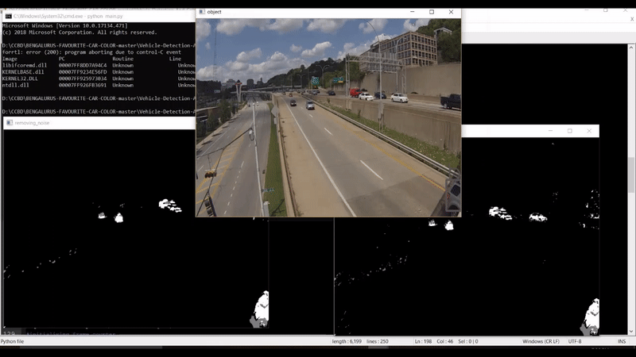

# Vehicle-Detection-And-Color-Classification
This is a simple Project that Detects moving objects in this case vehicles and classifies its color using k-means algorithm and finds the frequency of each color detected using Hadoop Map-Reduce algorithm.<br/>
## Working
The moving object is detected by subtracting the current frame from the previous frame thus any static objects compare to the previous frame is eliminated thus bringing out only the moving object, once the object is detected Morphological operations are done so that noises are eliminated and then Dialation are done to merge distorted blobs, then Contours are constructed to locate exact position of each object so that the corresponding dimensions can be used to extract the actual vehicle image from the original frame to get the rgb value and also to eliminate vehicals that are coming from far distance, once the dimesnions are obtained normalization of rgb values are done within the area so that each object has as a single rgb associated to the entire area.<br/>
Once the RGB values was obtained it was used to get the centroid of the cluster to which it actaully belonged to using k-means algorithm which was trained using predefined clusters centroids and values, but the model worked well but its accuracy can further be improved using different ML models.<br/>
Once the correspondinig colors were obtained the output was written to a file output.txt the final output file is then used to detect the frequency of each color  that was seen in the current traffic and predict which color vehical was most frequently purchased, using Hadoop Map-Reduce Algorithm.<br/>
The sample output is shown below.


## Requirements
<ul>
   <li>Python 3.6.5</li>
  <li>OpenCV 3</li>
  <li>Hadoop 2.6.4 on Ubuntu 16.04</li>
</ul>

## Usage
Clone this Repository from the Desktop
```
$git clone https://github.com/SKsaqlain/Vehicle-Detection-And-Color-Classification ColorCount 
```
To detect moving Vehicles/Objects run the below command
```
$cd ColorCount
$python3 main.py
```
The main.py Script produces output that is the number of different color vehicles detected in the current frame of the video.<br/>
Thus to find the frequency of each color the output.txt file has to be loaded into HDFS, run the below command to upload into HDFS after starting Hadoop.
```
hadoop fs -put <full path of the fileon local machine> <full path of the Storage on Hadoop>
$hadoop fs -put /home/hduser/Desktop/ColorCount/output.txt /Input
```
To compile the java Map-Reduce ColorCount program and run the jar file execute the below command
```
$chmod 777 start.sh
$./start.sh ColorCount
```
To see the output<br/>
Navigate to "http://localhost:50070" on your web browser<br/>
Click on the Utilities tab (top right)=>Browse the file system<br/>
Click on user=>hduser=>Output=>part-r-00000=> Download<br/>
The downloaded file contains the required output.


## License
This project is licensed under the MIT License[LICENSE.md]
